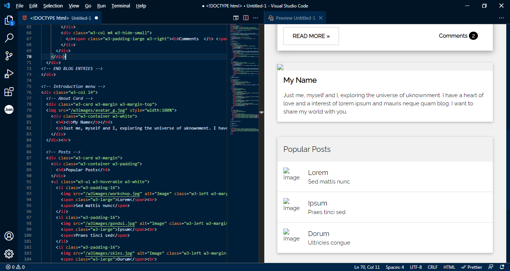

# FasterMars Dark theme 

A dark theme made by FasterMars, designed to focus on coding rather than getting distracted by unnecessary elements while giving your eyes rest.

Download the folder and move to
`C:\Users\<USERNAME>\.vscode\extensions\`

Restart Visual Studio Code and set color theme 
